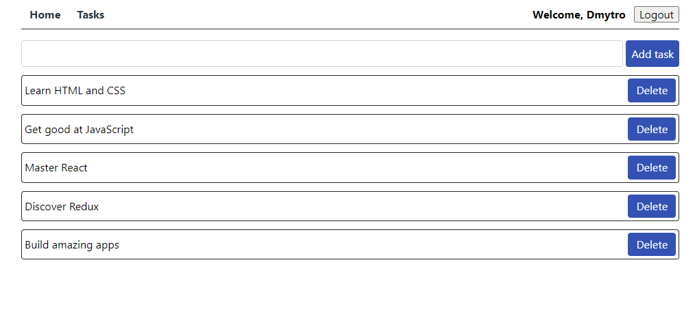

# ToDo

## Стек технологій

## Опис проекту

`"ToDo"` - це сервіс для створення, зберігання та організації ваших заміток.
Завдяки можливості реєстрації, ви отримуєте персональний простір для збереження
та управління своїми записів, завданнями та нагадуваннями.

`Основні функції:`

1.Зареєструйте свій обліковий запис, щоб мати доступ до особистих записів.

2.Створюйте необмежену кількість заміток.

3.Легкий у використанні та зручний інтерфейс робить процес створення та
редагування заміток приємним і ефективним.

`Посилання на сайт:` https://dmytro1117.github.io/react-course/
